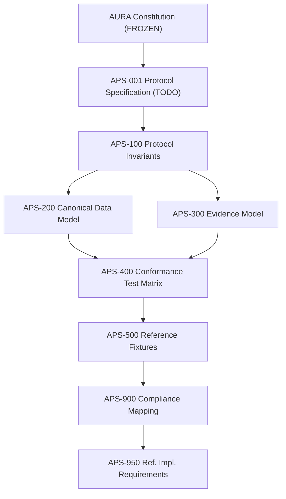
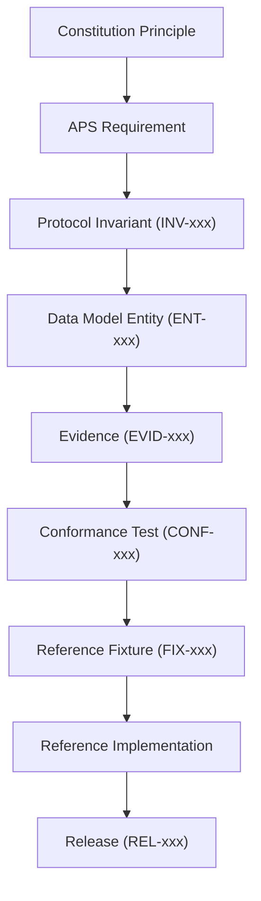

# Diagrams

This directory contains architecture and flow diagrams for the Aura Protocol.

## Naming

- Mermaid source: `DIAGRAM-NNN_TITLE.mermaid`
- SVG/PNG exports: `DIAGRAM-NNN_TITLE.svg`
- Companion description: `DIAGRAM-NNN_TITLE.md`

## Current Diagrams

| ID | Title | Format |
|----|-------|--------|
| DIAGRAM-001 | Canonical Document Hierarchy | Mermaid |
| DIAGRAM-002 | Traceability Chain | Mermaid |
| DIAGRAM-003 | Protocol Execution Lifecycle | TODO |
| DIAGRAM-004 | Evidence Pack Structure | TODO |

---

## DIAGRAM-001 — Canonical Document Hierarchy

---

## DIAGRAM-002 — Traceability Chain

